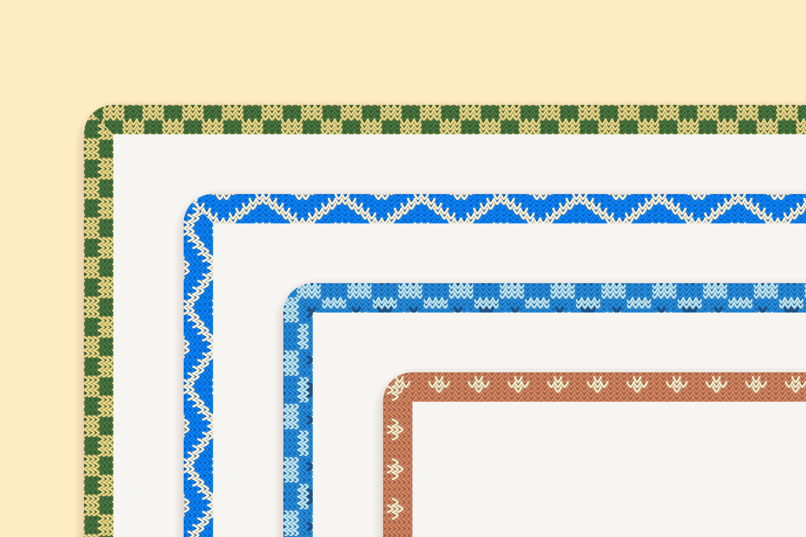
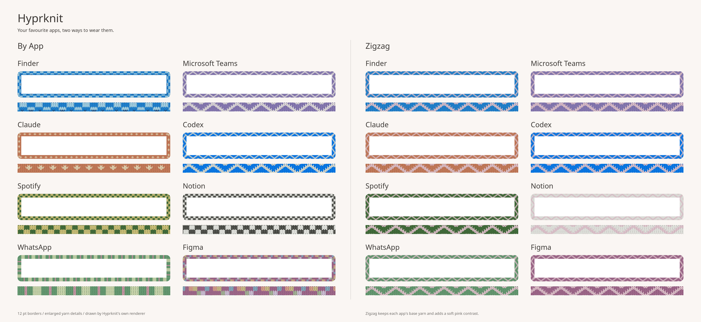

# Hyprknit

Hyprknit gives your Hyprland windows sweaters. 🧶
Knitted borders, colours inspired by your favourite apps, and a cosier desktop.



It is a port of [Window Sweaters](https://github.com/saragordic/window-sweaters)
by Sara Gordić, a Mac app that does the same thing. The renderer, the colourwork
charts and the colourways are hers; this is the Hyprland half. See
[NOTICE.md](NOTICE.md).

## Install on Omarchy

```bash
omarchy plugin add https://github.com/mirzap/hyprknit --enable
```

A ball of yarn appears in the bar. Click it and choose **Install native
knitting**. That builds the Hyprland half for the exact Hyprland you are running
— against the headers Omarchy's `hyprland` package already ships, so no source
is downloaded — loads it, and adds one marked line to
`~/.config/hypr/autostart.lua` so it comes back at every login. It takes a few
seconds, plus any build tools it has to install first.

After that the same menu sets the pattern — By App, plain Stockinette or Rib,
the six shared patterns (Zigzag, Picnic Checks, Ribbon Stripes, Little Bows,
Tiny Stars, Candy Stripes) and any charts of your own — plus border width,
corner radius, stitch rows, wool and dimming. The radius rounds both the outside
and the window-facing inside of the knitted band. Right click takes the sweaters
off or puts them back on, and
scrolling over the yarn steps through the shared patterns.

Focus changes ease between the active and unfocused wool brightness. The menu
offers transition presets from Off to Slow; Smooth (250 ms) is the default.

When an Omarchy update upgrades Hyprland, the next login notices and rebuilds the
knitting for it before loading. Until you log back in, it will not load into the
old Hyprland still running, which is exactly the mismatch that would crash it.

Not on Omarchy? `hyprpm add https://github.com/mirzap/hyprknit` builds against
the Hyprland release it selects. Hyprland's native API changes between releases;
until compatibility pins are published, use the current Hyprknit revision with
the current Hyprland release.

## Dependencies and permissions

Hyprknit contains a native C++ Hyprland plugin, loaded into the compositor
process. Installation is explicit: the bar menu may install `cmake`, `ninja`,
`gcc`, `pkgconf`, and `gdk-pixbuf2` through Omarchy's package helper, builds only
the source in this repository, and appends its marked login command to
`~/.config/hypr/autostart.lua`. It does not download or execute remote code at
runtime.

Installed binaries and build output live in
`~/.local/share/hyprknit/` and `~/.cache/hyprknit/`. Personal charts and
colourways live in `~/.config/hyprknit/` and remain after uninstall. The plugin
uses standard Omarchy commands plus `git`, `jq`, `pacman`, and core utilities.

## Build it yourself

Requirements are standard on Omarchy: Hyprland headers, CMake, Ninja, a C++23
compiler, and GdkPixbuf.

```bash
just test
just enable
```

Take it off again without changing any configuration or restarting Hyprland:

```bash
just disable
```

`hyprknitctl` refuses to load the plugin into a Hyprland that has been upgraded
since the session started, since that is exactly the mismatch that crashes it.

While the sweaters are on, Hyprknit temporarily hides Hyprland's native border
globally so the knitting is the only edge. Turning the sweaters off or unloading
the plugin restores the border size that was active before Hyprknit hid it.

## Make yourself cosy

Every setting can be changed live, without a rebuild:

```bash
./hyprknitctl pattern zigzag     # one shared pattern in each app's own colour
./hyprknitctl pattern by-app     # each app gets its own sweater again
./hyprknitctl pattern none       # plain knitting, no colourwork
./hyprknitctl stitch rib         # for plain knitting: stockinette, rib, garter
./hyprknitctl width 16           # border width in logical pixels
./hyprknitctl rows 8             # stitch rows across the band
./hyprknitctl basket sorbet      # wool for apps without their own colourway
./hyprknitctl dim 0.25           # darken unfocused windows
./hyprknitctl transition 400     # focus fade duration in milliseconds
./hyprknitctl status             # what is currently on the needles
```

The same settings can live in your Hyprland configuration instead:

```lua
hl.config({
  plugin = {
    hyprknit = {
      enabled = true,
      pattern = "by-app",
      stitch = "stockinette",
      basket = "wool",
      anchor = "corner",
      width = 12,
      rows = 6,
      rounding = -1, -- follow each window's own rounding
      dim = 0.3,
      focus_transition_ms = 250,
    },
  },
})
```

Configuration is optional; the defaults are the ones the Mac app ships with.

## The sweaters

**Custom sweaters for 37 apps, and counting.** Colours picked by hand, not read
from your icon theme.



Every sweater, with its yarns and its stitches up close:
[1](assets/collection-1.png) · [2](assets/collection-2.png) ·
[3](assets/collection-3.png) · [4](assets/collection-4.png) ·
[5](assets/collection-5.png). All of these pictures are drawn by Hyprknit's own
renderer, on Omarchy's square windows; `just catalogue` redraws them.

- **Browsers:** Firefox, Chrome, Chromium, Safari.
- **Work and notes:** Notion, Paper, Granola, Microsoft Teams, Slack, Zoom.
- **Coding and AI:** Cursor, VS Code, Claude, ChatGPT, Codex, Grok Bot, Ghostty.
- **Design:** Figma, Adobe Photoshop, Adobe Illustrator.
- **Microsoft Office:** Word, Excel, PowerPoint, Outlook.
- **Apple apps:** Finder, Mail, Messages, Notes, Calendar, Reminders, Music,
  Photos, Preview, Terminal.
- **More favourites:** Spotify, WhatsApp, Telegram, Discord.

macOS matches an app by its process name; Wayland has only an app id, so each
colourway also lists the ids its Linux build reports — `org.mozilla.firefox`
finds Firefox, `com.mitchellh.ghostty` finds Ghostty. An app id is matched as a
case-insensitive prefix, and a reverse-DNS id is also matched on its last
segment. Apps outside the collection get a colour chosen from their app id, so
it stays the same every time.

To look at one sweater on its own:

```bash
./build/hyprknit-swatch out --app Spotify --width 20
```

## Your own colourways

```text
~/.config/hyprknit/apps.conf
~/.config/hyprknit/charts/
```

`apps.conf` is seeded on first run. A rule looks like this:

```text
Claude = #D58561 atelier-claude
```

Your rules take priority over the built-in collection. Drop your own PNG charts
into the charts folder to add patterns or replace built-in ones: one pixel is
one colour cell, a transparent pixel keeps the app's own yarn, and the image's
size is the repeat. Then:

```bash
./hyprknitctl refresh
```

## A little work in progress

Native Hyprland plugins share the compositor process, so a defect here can end
your session. The plugin refuses to load against Hyprland headers it was not
built for. A manual `hyprknitctl enable` is session-level; installation through
the Omarchy menu adds the login entry described above.

## Taking it off

Choose **Uninstall knitting** from the yarn menu: it unloads the plugin, removes
its line from `autostart.lua`, and deletes the build. Then remove the widget:

```bash
omarchy plugin remove io.github.mirzap.hyprknit
```

Omarchy does not run uninstall hooks when removing a plugin. If you remove the
widget first, the native plugin stays loaded until logout; its copied login
script detects the missing checkout and removes the remaining installation at
the next login. Use **Uninstall knitting** first when you want it gone
immediately.

Unloading is safe while Hyprland runs: `just check-unload` proves it by loading
and unloading the plugin in a throwaway nested Hyprland. Your own
colourways stay in `~/.config/hyprknit/` until you delete that folder.

## Contributing

```bash
just test          # build and run the checks
just check-unload  # load, use and unload it in a throwaway nested Hyprland
just catalogue     # redraw the pictures in assets/
just fmt           # clang-format
```

## Credits and license

Ported from [Window Sweaters](https://github.com/saragordic/window-sweaters) by
Sara Gordić, which is built on
[JankyBorders](https://github.com/FelixKratz/JankyBorders) by Felix Kratz.
Released under [GPL-3.0](LICENSE). See [NOTICE.md](NOTICE.md) for attribution.
